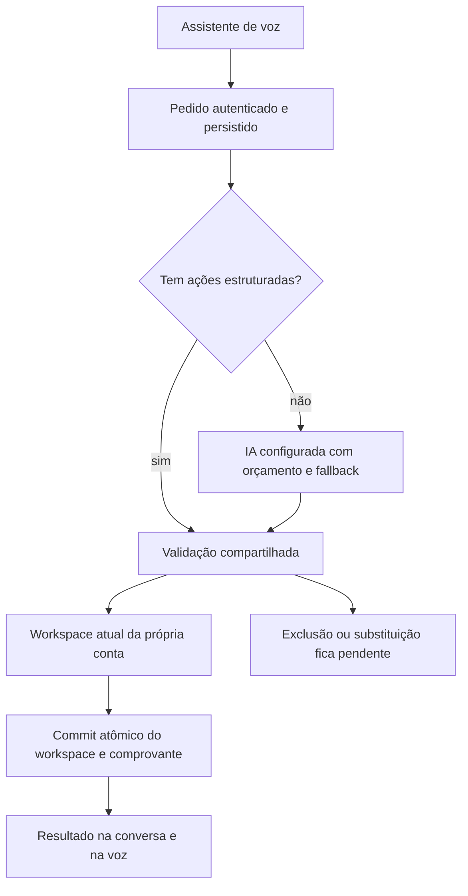

# Fundação do assistente da Jornada

Escopo: apenas `crm26gold/faculdadepsicologia`, Supabase `uccoaebzmvocqwqljmul`. Decisão do proprietário em 5/10/2026: priorizar infraestrutura, custo adicional mínimo e alinhamento gradual; preservar o visual aprovado. Este documento descreve o contrato atual e distingue as etapas seguintes.

## Execução disponível

- A ferramenta existente `organizar_jornada` aceita `instruction` e, opcionalmente, `actions_json`: uma string JSON contendo de uma a oito ações. Os parâmetros continuam primitivos, compatíveis com Gemini, ElevenLabs e xAI. O GPT-Live trabalha por delegação e hoje envia só a transcrição como `instruction` (`src/lib/voice/gpt-live.ts`): todo pedido de ação por ele ainda passa pelo planejador, que consome a API de texto.
- Ações completas passam pelo validador do servidor e executor do domínio, sem uma segunda chamada ao planejador. Isso evita depender dos créditos da API de planejamento para esse pedido. Não torna a voz gratuita, nem garante que o modelo sempre preencherá o campo opcional.
- Pedidos livres continuam usando a IA configurada. JSON fornecido inválido é recusado antes de enviar o pedido; não vira uma chamada paga silenciosamente.
- Conta e permissões vêm da sessão, nunca da proposta da IA. O modelo não pode fornecer confirmação, recibo ou credencial para aumentar autoridade. Ações destrutivas continuam pendentes e usam o mecanismo existente de confirmação.
- O pedido mantém a mesma chave idempotente, lease por execução e isolamento por usuário. O banco grava o workspace e o recibo juntos; a voz recebe o resultado depois. Repetir um pedido concluído não executa novamente. Um conflito revalida a mesma proposta no estado atual uma vez, sem gerar outra proposta.
- `result.execution` diferencia `structured` de `planned`. É evidência do caminho usado, não medição financeira. A resposta é produzida a partir das ações aplicadas, pendentes e recusadas, e não da promessa do modelo.
- Nada nesta etapa muda a configuração ativa de provedores, o compartilhamento de chaves, o logo, as telas, os termos ou os limites existentes. Não há migração nova.

## Regras únicas para todas as portas (09/10/2026)

Pedido do proprietário: qualquer porta de entrada (texto e voz no app, Telegram, WhatsApp, ChatGPT, Claude, Codex ou outro assistente pelo MCP) obedece às mesmas regras.

- **Uma fonte:** `src/lib/assistant-rules.ts` guarda as regras de pedido (lembrete, intensidade, `daqui`, tipo e área, foco pela aula, "esqueci o foco ligado") e o formato das ações. `commandSystem`, a voz ao vivo (`voiceSystem` e o catálogo de `actions_json`) e `mcpInstructions` são montados a partir dele. `tests/assistant-unified.test.ts` falha se uma regra não chegar a todas as portas.
  - Origem: em 09/10/2026, a voz ao vivo criou "Tomar água" sem aviso. O catálogo dela era escrito à mão e não tinha `remind` nem `daqui`.
- **Um motor:** todas as portas executam por `applyCommands`, que já calcula `daqui` na hora de Brasília e liga o foco à aula da grade.
- **Rede de segurança no motor:** quando a porta tem as palavras da pessoa (texto, voz ao vivo com a transcrição, Telegram, WhatsApp, MCP com `pedido` opcional), `completeFromRequest` completa o único compromisso do pedido:
  - "me lembra" sem aviso ganha aviso normal ("não me deixa esquecer": insistente; "só um aviso": suave);
  - "daqui N minutos" passa a ser contado pelo servidor.
  - Ela nunca cria nada sozinha e não mexe em pedidos com dois compromissos.
- **Versão:** o texto do app executa no navegador. `/api/ai/command` devolve `commandVersion`, e uma página mais antiga não executa: oferece "Atualizar e repetir". Ao mudar só o motor, suba `ENGINE_REVISION` em `src/lib/commands.ts`.
- **Critérios de segurança:**
  - Automático: inferência de baixo risco (pôr aviso, escolher tipo, área e matéria, calcular a hora, ligar o foco à aula, cancelar uma automação quando o estado muda).
  - Pede confirmação: exclusões acima do limite, substituição de anotação, ações coletivas destrutivas.
  - Dinheiro: só com valor dito pela pessoa.
  - Ambiguidade: uma pergunta.
  - Avisos gerados pelo sistema ("ainda em foco?", "o foco ficou ligado?") só perguntam e nunca alteram dados sem um toque da pessoa.
  - Cada automação tem um registro por item, escada finita, reserva antes de enviar e cancelamento quando o estado muda.

## Recursos e direção de acesso

| Recurso | Capacidade atual | Pode ser reserva automática de interpretação? |
| --- | --- | --- |
| APIs autorizadas | Texto/planejamento e, conforme o provedor, voz ou transcrição | Sim, nas rotas e permissões existentes |
| MCP da Jornada | Assistente externo consulta/registra na própria conta, por token pessoal ou OAuth | O assistente externo conduz a sessão; a Jornada não o chama de volta por esse vínculo |
| Servidor MCP externo | Descoberta, lista de ferramentas liberadas por conector e execução pelo proprietário na Administração, com confirmação e rastro (sem argumentos) | Não: o assistente da Jornada ainda não chama ferramentas externas; o servidor só recebe os argumentos digitados pelo proprietário |
| Assinaturas ChatGPT, Claude e ferramentas locais | Podem usar o MCP da Jornada quando o cliente oferece suporte | Não há adaptador de execução autônoma autenticado implementado para essas assinaturas |
| Telegram/WhatsApp | Transportes ligados à identidade e aos registros internos | Usam as fontes autorizadas do canal; o número não é a identidade durável |

MCP é um protocolo de acesso a ferramentas. A descoberta de um servidor não prova acesso a um modelo, e uma assinatura não vira automaticamente uma API de uso do sistema. Adaptadores novos exigem capacidade realmente documentada, autenticação suportada e teste do sentido desejado.

## Próximas etapas de infraestrutura

1. **Inventário de recursos — primeira parte entregue no lote A1 (mapa de recursos):** Administração › Inteligência artificial › Mapa de recursos mostra, para o proprietário, cada chave, conexão, chave pessoal, canal e MCP, com capacidades do adaptador, estado, declaração de privacidade e público. Para cada tarefa, mostra o que está configurado e o que realmente atua, com o motivo de cada exclusão, calculado pelas mesmas funções do roteador (`private.ai_resource_map`). A declaração de privacidade de uma fonte agora é separada de quem pode usá-la (“só eu” ou “eu e membros”). Falta: política de custo e domínio de cota verificados, registro de verificações e saúde (etapa 3). Não cadastrar preços ou cotas estimados como fatos.
2. **Contribuição da equipe:** criar adesão explícita separada de “Minhas chaves”. APIs cadastradas para a base do sistema podem atender todos, conforme os limites e autorizações definidos pelo proprietário. Chaves guardadas como pessoais continuam privadas até uma contribuição específica. Cada contribuição precisa definir público autorizado, finalidade, limites, revogação imediata e privacidade. Não usar silenciosamente a chave de outro membro.
3. **Roteamento com saúde persistente:** cooldown por domínio de cota, motivos de indisponibilidade, pausa por recurso/modelo e sugestões ao administrador. Atualmente cada falha tem uma classe e uma ação (tabela em [ARCHITECTURE.md](ARCHITECTURE.md)): sem saldo pula a empresa inteira naquele pedido, limite de pedidos tenta a próxima conexão no automático, e nada disso fica guardado entre pedidos. Não há rotação por projetos de terceiros. Só mudar isso após definir os domínios e autorizações. Chaves distintas não garantem cotas independentes.
4. **Trabalho autônomo:** worker com identidade própria restrita, agenda, retomada de leases, prazos, cancelamento, histórico e relatórios. A fila de pedidos atual é persistente, mas depende da execução da função ou de retomada pela conversa. Não afirmar que há monitoramento periódico quando não há worker ativo.
5. **Ferramentas externas — execução manual entregue em 08/10/2026:** lista de ferramentas liberadas por conector (zera ao trocar o endereço), execução só pelo proprietário com confirmação e rastro em `admin_audit_log`, proteção SSRF de `publicHttps` (`src/lib/integrations/mcp.ts`, `private.ai_connector_call`). Falta para o assistente usar: adaptador de MCP de saída com lista de destinos/ferramentas permitidos, proteção SSRF, autorização por pessoa, confirmação e idempotência conforme os efeitos. A reserva só pode escolher um recurso cuja capacidade e autorização tenham sido verificadas.

Cada etapa deve ser implementada e revisada antes de ativar a seguinte. O proprietário pediu uma pergunta material por vez e nenhuma contratação silenciosa.

Alinhamento posterior do proprietário nesta sessão: as APIs da base atendem o sistema todo; seus recursos MCP ficam sob seu controle, com escolha de quem pode usar, como e para quê, somente quando houver suporte técnico para essa capacidade. Recursos MCP de outros usuários atendem suas próprias contas. A cota de um usuário não deve atender outra pessoa. Uso para evolução do sistema exige finalidade e autorização específicas, revogáveis, do dono do recurso; conectar o MCP não concede essa permissão automaticamente. Este é o alcance desejado, não uma ativação automática de compartilhamento, nem confirmação de que uma assinatura pode funcionar como motor público.

## Validação e limites

Os testes usam dados e transportes sintéticos: execução sem planejador; compatibilidade do pedido antigo; conflito de revisão; replay; exclusão sem confirmação do modelo; lote inválido; falha de commit; contrato Gemini/ElevenLabs/xAI; integração do campo no navegador móvel e desktop. O isolamento de conta, leases e commit atômico continuam cobertos pelas suítes SQL e CI existentes.

O proprietário confirmou que o áudio ElevenLabs funcionou. A nova execução estruturada precisa de aceite real: pedir um registro, conferir `input.actions` e `result.execution` na própria conversa e encontrar o registro no sistema. Não realizar esse teste consumindo créditos sem alinhar com o proprietário.

A origem do erro 402 relatado ainda não foi comprovada por logs. O caminho novo elimina uma dependência específica; não corrige falta de créditos no provedor da própria voz. Medições reais de consumo, primeiro vínculo com clientes MCP externos e ativação real do número Oráculo permanecem verificações separadas.
