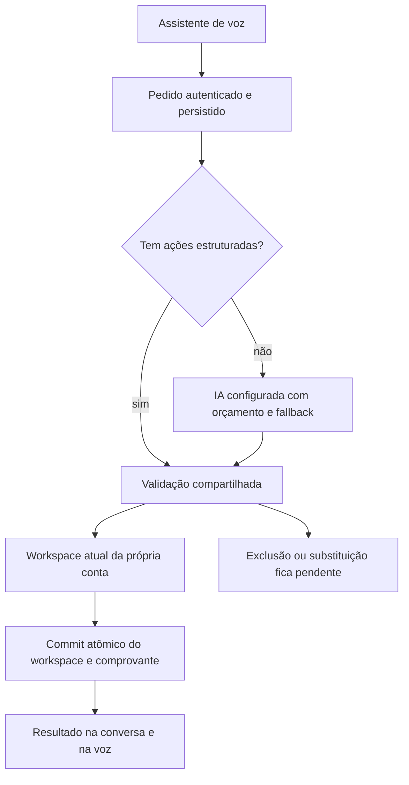

# Fundação do assistente da Jornada

Escopo: apenas `crm26gold/faculdadepsicologia`, Supabase `uccoaebzmvocqwqljmul`. Decisão do proprietário em 5/10/2026: priorizar infraestrutura, custo adicional mínimo e alinhamento gradual; preservar o visual aprovado. Este documento descreve o contrato atual e distingue as etapas seguintes.

## Execução disponível

- A ferramenta existente `organizar_jornada` aceita `instruction` e, opcionalmente, `actions_json`: uma string JSON contendo de uma a oito ações. Os parâmetros continuam primitivos, compatíveis com Gemini, ElevenLabs e xAI. O transporte GPT-Live usa o mesmo contrato de ferramentas.
- Ações completas passam pelo validador do servidor e executor do domínio, sem uma segunda chamada ao planejador. Isso evita depender dos créditos da API de planejamento para esse pedido. Não torna a voz gratuita, nem garante que o modelo sempre preencherá o campo opcional.
- Pedidos livres continuam usando a IA configurada. JSON fornecido inválido é recusado antes de enviar o pedido; não vira uma chamada paga silenciosamente.
- Conta e permissões vêm da sessão, nunca da proposta da IA. O modelo não pode fornecer confirmação, recibo ou credencial para aumentar autoridade. Ações destrutivas continuam pendentes e usam o mecanismo existente de confirmação.
- O pedido mantém a mesma chave idempotente, lease por execução e isolamento por usuário. O banco grava o workspace e o recibo juntos; a voz recebe o resultado depois. Repetir um pedido concluído não executa novamente. Um conflito revalida a mesma proposta no estado atual uma vez, sem gerar outra proposta.
- `result.execution` diferencia `structured` de `planned`. É evidência do caminho usado, não medição financeira. A resposta é produzida a partir das ações aplicadas, pendentes e recusadas, e não da promessa do modelo.
- Nada nesta etapa muda a configuração ativa de provedores, o compartilhamento de chaves, o logo, as telas, os termos ou os limites existentes. Não há migração nova.

## Recursos e direção de acesso

| Recurso | Capacidade atual | Pode ser reserva automática de interpretação? |
| --- | --- | --- |
| APIs autorizadas | Texto/planejamento e, conforme o provedor, voz ou transcrição | Sim, nas rotas e permissões existentes |
| MCP da Jornada | Assistente externo consulta/registra na própria conta, por token pessoal ou OAuth | O assistente externo conduz a sessão; a Jornada não o chama de volta por esse vínculo |
| Cadastro de servidor MCP externo | Descoberta e inventário de ferramentas | Não: execução de ferramentas externas ainda não implementada |
| Assinaturas ChatGPT, Claude e ferramentas locais | Podem usar o MCP da Jornada quando o cliente oferece suporte | Não há adaptador de execução autônoma autenticado implementado para essas assinaturas |
| Telegram/WhatsApp | Transportes ligados à identidade e aos registros internos | Usam as fontes autorizadas do canal; o número não é a identidade durável |

MCP é um protocolo de acesso a ferramentas. A descoberta de um servidor não prova acesso a um modelo, e uma assinatura não vira automaticamente uma API de uso do sistema. Adaptadores novos exigem capacidade realmente documentada, autenticação suportada e teste do sentido desejado.

## Próximas etapas de infraestrutura

1. **Inventário de recursos:** registrar dono, autorização, direção de acesso, capacidades (texto, planejamento, voz, transcrição, ferramenta), política de custo e domínio de cota. Uma assinatura, um servidor MCP e uma chave API são recursos diferentes. Não cadastrar preços ou cotas estimados como fatos.
2. **Contribuição da equipe:** criar adesão explícita separada de “Minhas chaves”. Chaves pessoais continuam privadas. Cada contribuição precisa definir público autorizado, finalidade, limites, revogação imediata e privacidade. Não usar silenciosamente a chave de outro membro.
3. **Roteamento com saúde persistente:** cooldown por domínio de cota, motivos de indisponibilidade, pausa por recurso/modelo e sugestões ao administrador. Atualmente o automático troca de empresa após esgotamento de cota; não há rotação por projetos de terceiros. Só mudar isso após definir os domínios e autorizações. Chaves distintas não garantem cotas independentes.
4. **Trabalho autônomo:** worker com identidade própria restrita, agenda, retomada de leases, prazos, cancelamento, histórico e relatórios. A fila de pedidos atual é persistente, mas depende da execução da função ou de retomada pela conversa. Não afirmar que há monitoramento periódico quando não há worker ativo.
5. **Ferramentas externas:** adaptador de MCP de saída com lista de destinos/ferramentas permitidos, proteção SSRF, autorização por pessoa, confirmação e idempotência conforme os efeitos. A reserva só pode escolher um recurso cuja capacidade e autorização tenham sido verificadas.

Cada etapa deve ser implementada e revisada antes de ativar a seguinte. O proprietário pediu uma pergunta material por vez e nenhuma contratação silenciosa. A próxima decisão de produto é o escopo da contribuição voluntária da equipe: somente o proprietário, membros escolhidos ou base pública limitada.

## Validação e limites

Os testes usam dados e transportes sintéticos: execução sem planejador; compatibilidade do pedido antigo; conflito de revisão; replay; exclusão sem confirmação do modelo; lote inválido; falha de commit; contrato Gemini/ElevenLabs/xAI; integração do campo no navegador móvel e desktop. O isolamento de conta, leases e commit atômico continuam cobertos pelas suítes SQL e CI existentes.

O proprietário confirmou que o áudio ElevenLabs funcionou. A nova execução estruturada precisa de aceite real: pedir um registro, conferir `input.actions` e `result.execution` na própria conversa e encontrar o registro no sistema. Não realizar esse teste consumindo créditos sem alinhar com o proprietário.

A origem do erro 402 relatado ainda não foi comprovada por logs. O caminho novo elimina uma dependência específica; não corrige falta de créditos no provedor da própria voz. Medições reais de consumo, primeiro vínculo com clientes MCP externos e ativação real do número Oráculo permanecem verificações separadas.
