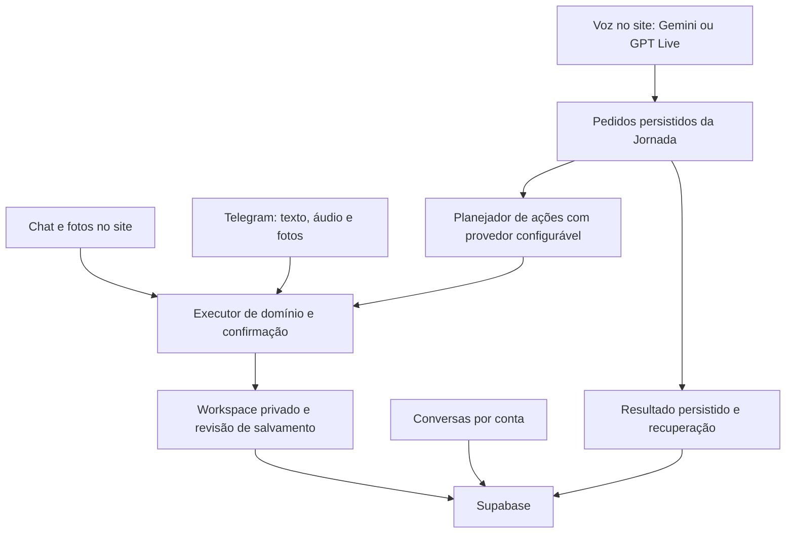

# Jornada Plena: plano de voz e continuidade

Atualizado em 3 de outubro de 2026. Projeto exclusivo: Faculdade / `crm26gold/faculdadepsicologia`, Vercel `faculdadepsicologia`, Supabase `uccoaebzmvocqwqljmul`.

## O acordo de experiência

Durante o dia, você conversa e organiza; depois, revisa registros, pendências e gráficos no painel. A voz deve ser calma, fazer perguntas com propósito e manter o assunto mesmo quando você acrescentar informações. Conversar e sugerir não autoriza mudanças; um pedido explícito autoriza execução, com confirmação adicional para exclusão/substituição de nota.

O assistente precisa dizer o que sabe, o que foi informado, o que está pendente e o que realmente salvou. Não deve inventar detalhes para preencher lacunas. Para compras, comprovantes da mesma compra corrigem o registro original; compras futuras ajudam com referências. A fonte e o relato original precisam continuar acessíveis.

## Arquitetura construída nesta etapa

A inteligência central hoje consiste no contrato dos dados, consultas, validação de ações, confirmação, idempotência, histórico, persistência, anexos e regras de comportamento. Essas peças pertencem à Jornada. Os modelos fornecem interpretação, planejamento e voz e podem ser substituídos por adaptadores.

Persistir histórico e regras não treina automaticamente um modelo próprio. Para manter qualidade entre fornecedores, cada alternativa deve passar pelos mesmos cenários de conversa e execução. Falhas após uma gravação não podem disparar outra execução como se nada tivesse ocorrido.

## Entregas e situação

| Parte | Implementação desta etapa | Validação que ainda importa |
| --- | --- | --- |
| Voz Gemini | Seleção de modelo regular; restrições de autorização; alternativa documentada para configuração 400 | Sessão autenticada com áudio real e resposta do provedor |
| Voz OpenAI | Adaptador GPT Live/WebRTC; delegação para o executor próprio | Chave de API com acesso e cota; áudio real no celular |
| Histórico | Busca, título, fixação, arquivo, exportação e retomada; nuvem por conta e recuperação manual do histórico antigo | Uso na conta real em dois dispositivos |
| Continuidade | Pedido aceito no banco; função continua após fechar chamada; resultado e workspace na mesma transação | Teste real de fechar chamada durante um pedido |
| Fotos | Original privado, leitura multimodal e interpretação identificada | Foto real legível, conferir interpretação e fonte |
| Telegram | Mesmo workspace; fotos privadas; /voz e /ligar abrem o site | Enviar ao próprio bot uma foto e conferir sua anotação |
| Android | Instalação quando oferecida pelo navegador; controles de mídia quando suportados | Aplicativo nativo para garantir chamada em segundo plano |
| Compras com fontes | Regras de perguntas e incerteza; relato original e foto preservados | Estrutura própria de itens, fontes, correções e reconciliação |
| WhatsApp | Ainda não ativado | Conta/número elegíveis, autorização e regras oficiais aplicáveis |
| MCP da Jornada | Contratos de consultas e ações reutilizáveis | Conector com autorização por usuário e escopos próprios |

Este arquivo descreve código e etapas, não prova publicação na Vercel nem uma chamada real. A entrega deve informar separadamente commit/publicação, testes locais e serviços realmente validados.

## Ordem de conclusão

### 1. Publicar e validar uma chamada real

Publicar somente após os gates. Primeiro testar o Gemini com a correção de configuração. Se não abrir, usar o código da nova chamada e os logs permitidos para identificar a etapa. O erro antigo não é prova de problema financeiro.

O GPT Live é uma opção adicional. Configurar uma chave na Administração, sem compartilhá-la no chat, e testar separadamente. Assinaturas de Codex, Claude Code ou Antigravity são ferramentas para desenvolvimento e não autorizam usar sua sessão como backend comercial da Jornada. MCP não substitui o transporte de áudio nem fornece cota de voz.

Critério: ouvir resposta, consultar dados reais, criar/reagendar um compromisso, pedir exclusão com confirmação e conferir persistência em outro aparelho.

### 2. Fechar o ciclo completo de compras

Criar estrutura própria de compra, itens, origem, comprovante, pendências e histórico de revisões. Guardar valores individuais ausentes como nulos, nunca zero ou divisão do total. Registrar total e itens conhecidos, mantendo a observação de que os valores individuais não foram informados.

Anexar um comprovante precisa identificar a compra correspondente. Propor alterações com a fonte e o antes/depois; executar o pedido autorizado sobre o mesmo registro. Revisões são eventos persistidos, não sobrescrita silenciosa. Fotos ambíguas pedem esclarecimento. Não criar um segundo gasto apenas por receber uma nota.

Critério: exemplo de R$50 sem preços individuais, comprovante posterior da mesma compra, sem duplicação, relatório conciliado e original recuperável.

### 3. Telegram como outra entrada

Validar o bot existente antes de adicionar infraestrutura. Texto, foto e áudio devem usar a mesma identificação de usuário e as mesmas regras. A integração oficial de bot recebe mensagens; chamadas diretas não estão disponíveis na Bot API. O atalho /voz abre a chamada da Jornada autenticada.

Depois unificar a exibição de conversas entre os canais com origem visível, preservando consentimentos e identificadores dos eventos. A transcrição de áudio do Telegram ainda depende de Gemini/Vertex, mesmo que a voz do site seja trocada para OpenAI.

### 4. Android com chamada em segundo plano

A instalação do site facilita o acesso, mas não garante microfone ativo com a tela bloqueada. Aplicativo nativo ou uma camada nativa de áudio/WebRTC precisa integrar serviço de microfone em primeiro plano, notificação persistente, permissão explícita e controles de encerrar/silenciar. Um simples WebView não resolve isso sozinho.

Planejar retomada ao trocar Wi-Fi/dados móveis, saída Bluetooth, ligação telefônica interrompendo o áudio e encerramento do serviço quando a pessoa termina. O processamento dos pedidos continua no servidor, independentemente desse aplicativo.

Critério: Android real, outro aplicativo aberto, tela bloqueada, rede alterada e microfone realmente liberado ao encerrar. Escolha de tecnologia nativa deve aproveitar o frontend existente sem prometer que Capacitor/PWA por si só entrega esses requisitos.

### 5. WhatsApp oficial

Situação informada pelo usuário: **WhatsApp Business no celular**, ainda sem confirmação de conta de API. A preparação guiada está em [WHATSAPP_PREPARACAO.md](./WHATSAPP_PREPARACAO.md).

Antes de implementar o canal, identificar quem controla o número e sua elegibilidade na plataforma empresarial. Um número descartável não comprova WABA, aprovação de remetente ou autorização para chamadas.

Integrar mensagens, anexos e áudios ao mesmo núcleo com vinculação do número à conta. Avaliar a Business Calling API somente para uma conta elegível, com autorização da pessoa. Verificar termos vigentes na região: a política para assistentes de IA mudou e não deve ser tratada como um bloqueio universal nem como acesso irrestrito. Não usar automação de WhatsApp Web como substituto silencioso da API oficial.

O usuário deverá realizar somente cadastro, verificação do número/empresa e autorização que exijam sua identidade. Código, validação de webhook, eventos idempotentes e isolamento continuam sendo trabalho do projeto.

### 6. MCP, memória e alternativas de provedor

Expor ferramentas da Jornada com OAuth, escopos por usuário, auditoria e revogação: consultar, propor/executar ações autorizadas e completar pendências. Nunca oferecer SQL administrativo, chave de serviço do Supabase ou ferramenta de implantação aos usuários finais.

MCP pode permitir que ChatGPT/Claude consultem a Jornada com autorização. A experiência de voz própria continua precisando de API ou infraestrutura de áudio. Integrar novas ferramentas somente quando atenderem a uma tarefa concreta.

Evoluir memória explícita: preferências consentidas, fatos com fonte, pendências e correções. Separar lembrança de hipótese. Testar provedores com um conjunto comum: ambiguidade, interrupção, retomada, informações incompletas, correção, privacidade, latência e custo. Troca entre provedores exige nova sessão/contexto e conferência do estado de execução; ainda não há failover automático entre fornecedores nesta etapa.

## O que depende do usuário

1. Testar a nova publicação no próprio celular, com sua sessão autenticada.
2. Se escolher GPT Live, cadastrar a própria chave de API na Administração e conferir acesso/cota do projeto de API.
3. Enviar uma foto de teste ao próprio Telegram já vinculado.
4. Para WhatsApp Business no celular, preparar a conta de API e concluir as verificações oficiais da Meta.
5. Para aplicativo Android, testar no aparelho e decidir forma de distribuição quando houver um build concreto.

Detalhes dos controles, configuração e privacidade estão em [ASSISTENTE_VOZ.md](./ASSISTENTE_VOZ.md). Cada etapa precisa produzir algo revisável e um resultado verificável antes de avançar.
