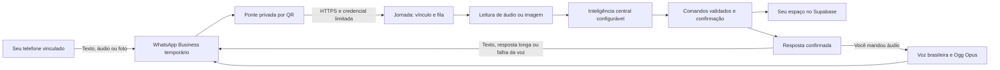

# WhatsApp da Jornada Plena

## O que foi implementado

O WhatsApp Business de um número temporário funciona como transporte. A conta da Jornada, no Supabase `uccoaebzmvocqwqljmul`, continua sendo a proprietária do espaço, das permissões e do histórico. A integração usa **whatsapp-web.js 1.34.7**, conexão por QR e sessão exclusiva; não reutiliza tokens, banco ou sessão do ZapBot.



## Ativar, passo a passo

1. No **computador**, entre na Jornada como proprietário. Abra **Administração › WhatsApp da Jornada**.
2. Toque em **Criar conexão e baixar configuração**. Salve `jornada-whatsapp-config.json`. Esse arquivo é uma credencial privada; não o publique nem o envie em mensagens. A criação substitui qualquer credencial anterior e exige novo vínculo do telefone.
3. Abra o terminal na pasta `C:\Users\Yeshua\Desktop\Faculdade` e execute:

   ```powershell
   npm run whatsapp:setup
   ```

   Pressione Enter se o arquivo está em Downloads, ou informe seu caminho. O instalador valida o endereço HTTPS, instala a ponte pelo lockfile e inicia Chromium sem uma janela. Node.js 24 e internet são necessários.

4. Volte ao painel. No WhatsApp Business do **número temporário**, abra **Aparelhos conectados › Conectar um aparelho** e escaneie o QR mostrado na Jornada.
5. Quando aparecer **WhatsApp conectado**, toque em **Gerar código de vínculo**. Do **seu outro telefone**, envie `/vincular CODIGO` para o número temporário. O código expira em 15 minutos e só vale uma vez. A ponte não é dona da conta.
6. Em **Inteligência e voz**, selecione uma conexão habilitada para transcrição: Groq (`whisper-large-v3-turbo`), OpenAI (`gpt-4o-mini-transcribe`) ou Google compatível. Gemini exige declaração de API paga em Minhas chaves de IA. Para fotos, use uma rota de texto com visão. A resposta usa a tarefa **Conversa do assistente**, que pode ser de outra empresa. Voz: Antônio ou Francisca, em português brasileiro.
7. Envie um áudio de teste: “Crie uma anotação chamada teste do WhatsApp com o texto conexão validada”. Confira no Caderno e ouça a resposta. Depois teste consulta e exclusão com confirmação. Esse teste real é o critério de aceite; testes de código ou somente QR não o substituem.
8. Confira a resistência a quedas, com o terminal da ponte à vista:
   - **Texto recebe texto:** escreva “O que tenho hoje?”; a resposta chega escrita.
   - **Áudio recebe áudio:** pergunte o mesmo por áudio; a resposta chega em voz.
   - **Resposta longa sai em texto:** peça por áudio “Liste todas as minhas tarefas com os detalhes”; acima de 600 caracteres, a resposta chega escrita.
   - **A rede cai e a mensagem chega depois:** com a ponte conectada, desligue o Wi-Fi do computador, mande uma mensagem do celular, espere um minuto e religue o Wi-Fi. A resposta chega sem você reenviar.
   - **A ponte reconecta sozinha:** pare a ponte, desligue o Wi-Fi do computador e inicie a ponte de novo. O terminal mostra “Não consegui abrir o WhatsApp Web. Nova tentativa em 5 s.” Religue o Wi-Fi: sem reiniciar a ponte, o painel volta a **WhatsApp conectado** e uma mensagem enviada depois é respondida.

Para iniciar novamente depois da instalação: `npm run whatsapp:start`. Depois de atualizar o projeto, pare a ponte com Ctrl+C e inicie de novo; a ponte em execução continua com o código antigo. Mantenha o terminal e o computador ligados. Para serviço 24 horas, hospede **somente a ponte** em um servidor persistente; esta entrega não compra servidor nem reativa o faturamento Google Cloud.

Outras pessoas vinculam o próprio telefone em **Meu espaço › WhatsApp da minha conta**, sem acesso ao QR ou à credencial da ponte. A ponte precisa estar online; o código vale 15 minutos. Cada conta usa suas APIs pessoais ou a base de texto expressamente autorizada. Desvincular cancela pedidos ainda aguardando e preserva registros já confirmados.

## Controles e limites

- **Pausar**: desmarque “Permitir pedidos pelo WhatsApp” e salve. Os pedidos em andamento não podem confirmar novas alterações enquanto a ponte estiver pausada. Uma alteração já confirmada permanece no espaço.
- **Revogar acesso**: cancela o vínculo e os pedidos aguardando, preservando os registros e o histórico da conta.
- **Substituir credencial**: revoga a ponte anterior e os códigos/vínculos. A chave antiga deixa de funcionar. Escaneie novamente e vincule o outro telefone. Trocar o número da sessão também exige novo vínculo.
- A API aceita somente telefones privados, texto até 2.400 caracteres e áudios/fotos até 2 MB. Áudio: até 180 segundos declarados pelo transporte. Arquivos executáveis, documentos, grupos, status e URLs de arquivos são rejeitados. A identificação do formato verifica os bytes, além do MIME.
- A fila guarda o conteúdo cifrado até o pedido terminar. Depois apaga o áudio/foto original e mantém transcrição e recibo. **Não é um arquivo de comprovantes**: nesta etapa a imagem é lida, mas não anexada permanentemente a uma nota. Anexe o comprovante no aplicativo se precisar conservá-lo.
- Histórico: últimas 60 mensagens por conta neste canal; recibos de repetição por 31 dias. Há no máximo 20 pedidos aguardando, três tentativas após abandono de execução e validade de um dia para entrada. Os limites globais de IA, uploads e mídia da Jornada também se aplicam. Eles não são uma garantia da cobrança total de fornecedores externos.
- Exclusões e substituição completa de notas ficam pendentes por 15 minutos, vinculadas ao registro e a sua versão. Confirme com a frase exata **“confirmar 123456”**, usando o código recebido; “cancelar” descarta a confirmação. Mudanças posteriores no item invalidam a autorização antiga.
- A credencial da ponte não permite consultar chaves de IA diretamente no banco: as funções internas exigem também uma prova que só o servidor da Jornada possui. A ponte não recebe `AI_KEYS_SECRET`, token de Supabase ou chave de provedor.
- Os comandos passam pelas regras existentes de agenda, notas, finanças, hábitos, metas/projetos e foco. O assistente não executa SQL, shell, administração de credenciais ou envio a terceiros.
- **Voz ou texto:** a resposta sai em voz só quando você manda áudio e ela tem até 600 caracteres. Texto recebe texto; respostas longas, erros e avisos de pedidos cancelados saem em texto. Só o texto das respostas em voz vai ao serviço online Edge TTS. O áudio retornado é convertido localmente em Ogg Opus mono. Se a voz falhar, entrega-se a resposta confirmada em texto. Os arquivos temporários de síntese são removidos.
- **Falha ao falar com a Jornada:** se a ponte não consegue entregar à Jornada uma mensagem recebida, por erro de rede ou do servidor (5xx), ela tenta de novo depois de 0,5 s, 2 s e 5 s. Uma recusa (4xx, por exemplo telefone não vinculado ou limite atingido) não é repetida. Repetir não duplica o pedido: a fila reconhece a mensagem pelo identificador. Com mais de 20 mensagens em andamento, as novas são descartadas e o terminal mostra quantas; peça para reenviar.
- **Queda do WhatsApp:** a ponte reconecta sozinha, esperando 5 s, 10 s, 20 s e assim por diante, até no máximo 5 minutos entre tentativas. Enquanto isso o painel mostra **Conectando ao WhatsApp** e a ponte não responde. Ela não reconecta quando a sessão foi encerrada no celular, aberta em outro lugar ou o número foi bloqueado; o terminal diz o que fazer. Os registros do terminal mostram só o código de estado do WhatsApp, nunca o conteúdo de mensagens.
- Uma alteração e seu recibo são confirmados em uma única transação, com revisão e exclusividade temporária de execução. Reenviar a mesma mensagem não repete o comando. **A entrega no WhatsApp não tem garantia de exatamente uma vez**: se houver queda durante o envio, a ponte sinaliza “entrega incerta” e não reenvia automaticamente. Confira a conversa antes de pedir uma nova entrega.

## Operação e segurança

`integrations/whatsapp-bridge/.state` contém sessão, credencial e recibos locais privados e está fora do Git. O instalador remove permissões herdadas dessa pasta no Windows e autoriza a conta local que o iniciou. Mantenha o sistema operacional e navegador atualizados. Não copie a pasta para outro projeto nem exponha portas do worker: ele só faz conexões HTTPS de saída.

A implementação é **não oficial**. A biblioteca informa que a conta pode ser bloqueada; nenhuma tecnologia elimina esse risco. Esta fase troca mensagens de voz: **não atende ligações ao vivo pelo WhatsApp**.

## Verificação técnica

```powershell
npm test
node --test integrations/whatsapp-bridge/protocol.test.mjs
npm run build
```

No banco Postgres **descartável**: `supabase/tests/whatsapp_bridge.sql` verifica autorização dupla, código de uso único, repetição, exclusividade de execução, conflito de revisão, confirmação atômica, limpeza de mídia e revogação. **Nunca execute o stub de teste no projeto Supabase real.**

Testes opcionais explícitos, depois da instalação, sem conectar conta nem enviar mensagens:

```powershell
node integrations/whatsapp-bridge/smoke.mjs --speech
node integrations/whatsapp-bridge/smoke.mjs
```

## Fontes consultadas em 4 de outubro de 2026

- [whatsapp-web.js: documentação atual](https://docs.wwebjs.dev/)
- [Client: QR, IDs LID/telefone e mídia](https://docs.wwebjs.dev/Client.html)
- [Envio de mensagens de voz](https://docs.wwebjs.dev/global.html#MessageSendOptions)
- [node-edge-tts: configuração e limites](https://github.com/SchneeHertz/node-edge-tts)
- [Puppeteer: versões e configuração](https://pptr.dev/guides/configuration)

Puppeteer 25.12.0 está fixado como substituição explícita da dependência antiga da biblioteca WhatsApp. A alteração deve passar pelos testes de abertura de Chromium e obtenção de QR; não presumir compatibilidade futura. `allowScripts` autoriza somente as versões fixadas dos instaladores do navegador e FFmpeg.
